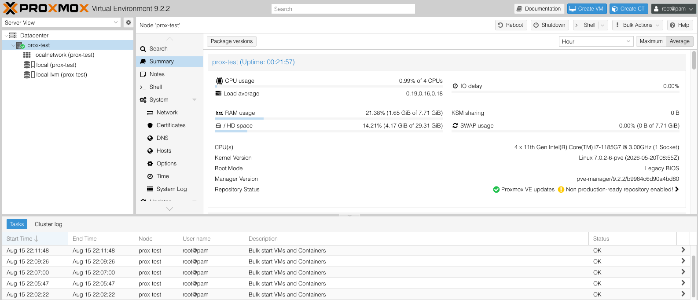

# 🖥️ Virtualization Lab (Proxmox)

**Status: 🟡 In Progress**

Bare-metal virtualization environment built with **Proxmox VE** and repurposed hardware.

This lab provides the virtualization foundation for the broader infrastructure homelab, supporting Windows and Linux workloads used throughout networking, identity, automation, monitoring, container, and security projects.


_Proxmox VE 9.2.2 running in the temporary VMware Workstation test environment._

## Objectives

- Deploy and administer Proxmox VE on bare-metal hardware
- Design host storage for system and virtual workloads
- Configure Linux bridge and VLAN-aware virtual networking
- Build reusable Linux and Windows VM templates
- Manage the VM lifecycle including cloning, snapshots, backups, and migration
- Expand from a single host toward a multi-node virtualization environment

## Technologies

- Proxmox VE
- KVM/QEMU
- Cloud-init
- LVM-thin
- Linux bridges
- VLAN tagging

## Architecture

```text
Physical Hosts
      │
      ▼
 Proxmox VE
      │
      ├── Storage
      ├── Virtual Networking
      │
      └── Virtual Machines
              │
              ▼
      Infrastructure Labs
```

Containerized workloads are deployed through **Docker running within Linux virtual machines**, rather than directly through Proxmox LXC containers.

## Implementation

- [x] Deploy initial Proxmox VE bare-metal host
- [x] Complete post-install repository and system configuration
- [x] Validate CPU virtualization support, memory, storage, and system health
- [x] Configure Proxmox management networking
- [x] Establish host and VM storage design
- [ ] Configure dedicated VM storage
- [ ] Create Linux cloud-init template
- [ ] Create Windows Server template
- [ ] Configure VLAN-aware virtual networking
- [ ] Test snapshots and cloning
- [ ] Configure VM backup and restore
- [ ] Add additional Proxmox hosts
- [ ] Test migration and clustering

## Storage Design

The initial host uses separate storage for the hypervisor and primary virtual workloads:

```text
Proxmox Host
│
├── System SSD
│   ├── Proxmox VE
│   ├── Local storage
│   └── Secondary VM storage
│
└── VM SSD
    └── Primary VM storage
```

Detailed hardware specifications and unique system identifiers are excluded from public documentation where unnecessary.

## Networking

Proxmox uses a Linux bridge to connect virtual machines to the physical network:

```text
Physical NIC
     │
     ▼
   vmbr0
     │
     ├── Proxmox Management
     └── Virtual Machines
```

VLAN-aware networking will be introduced as network segmentation is implemented across the broader homelab.

## Documentation

Supporting documentation covers:

- Proxmox host deployment
- Storage configuration
- Proxmox networking
- VM templates
- Backup and recovery
- Troubleshooting and lessons learned

## Downstream Projects

This virtualization environment provides infrastructure for:

- [Active Directory Lab](../active-directory-lab/)
- [Docker / Self-Hosted Services](../docker-self-hosted-services/)
- [Kubernetes Lab](../kubernetes-lab/)
- [Infrastructure Monitoring](../infrastructure-monitoring/)
- [Security Operations Lab](../security-operations-lab/)
- [Infrastructure Automation](../infrastructure-automation/)

## Folder Structure

```text
virtualization-lab/
├── README.md
├── docs/
├── scripts/
└── diagrams/
```

## Next Steps

1. Configure dedicated VM storage
2. Build reusable Linux and Windows templates
3. Deploy initial infrastructure workloads
4. Introduce VLAN-aware networking
5. Configure backup and recovery
6. Add additional Proxmox hosts
7. Test migration and clustering
