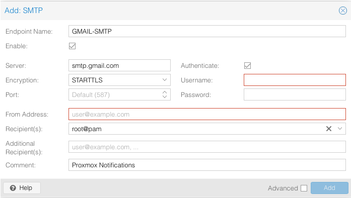
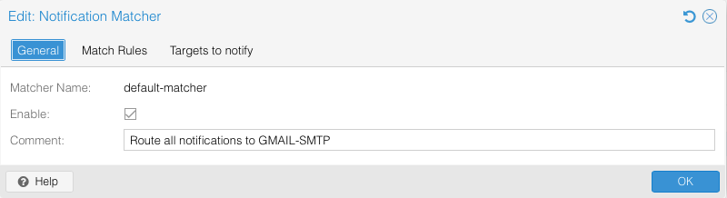
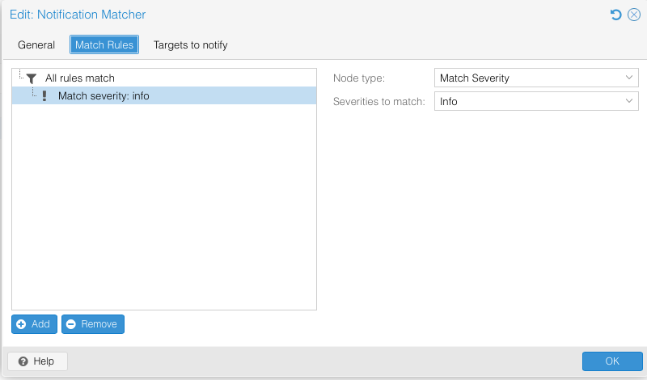
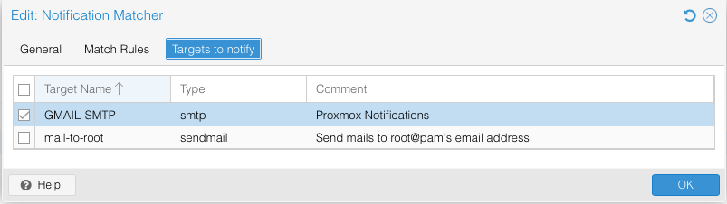

# 📧 Proxmox Notifications

This configuration provides Datacenter-level email notifications delivered through Gmail SMTP. I created a dedicated Google account for infrastructure notifications instead of using my personal account.

## Architecture

Proxmox VE  
↓  
Notification Matcher  
↓  
Gmail SMTP  
↓  
Administrator Email

## SMTP Target

The SMTP target was configured to use Gmail's SMTP service with authentication and encrypted transport over `STARTTLS` on port `587`.

*Gmail SMTP target configured in Proxmox.*

## Authentication

I enabled 2FA on the dedicated notification account, but Proxmox's SMTP integration uses standard SMTP authentication and could not complete Google's interactive 2FA flow. To work around this, I generated a Google App Password specifically for Proxmox.

Google recommends modern authentication methods over App Passwords when supported, so I limited this approach to a dedicated Google account used only for infrastructure notifications. The App Password can also be revoked independently without exposing or changing the account's primary password.

SMTP traffic was configured to use `STARTTLS` over port `587` so authentication and notification traffic are encrypted in transit.

## Matcher

I kept the default Proxmox matcher and pointed it at the Gmail SMTP target.

- Matcher: `default-matcher`
- Target: `GMAIL-SMTP`
- Severity: `info`
- Rule behavior: All rules match

*Default notification matcher with severity and target rules applied.*

I started with `info` alerts deliberately to capture routine events for the first few weeks and establish a baseline for what normal looks like. The threshold can be raised once the normal notification volume is clear.

*Matcher severity configured at `info` to include informational events and higher-severity notifications.*

The matcher was then configured to send matching events to the `GMAIL-SMTP` notification target.

*Default matcher routing notifications to the Gmail SMTP target.*

## Validation

- Test notification delivered successfully to the administrator inbox.
- SMTP connection configured with `STARTTLS` over port `587`.
- App Password authenticated successfully with 2FA active on the dedicated account.
- `default-matcher` confirmed routing notifications to `GMAIL-SMTP`.
- Credentials excluded from the repository; email addresses replaced with placeholders and sanitized from screenshots.

## Scaling Considerations

Gmail SMTP is appropriate for a homelab of this size. In a larger or production environment, I would use a dedicated SMTP relay or managed notification service so alerting does not depend on a single Google account and manually managed App Password.
